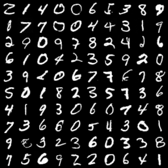
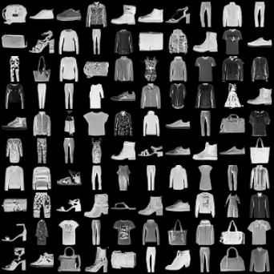
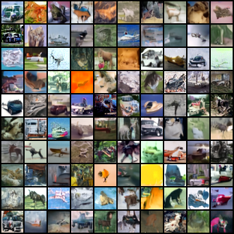
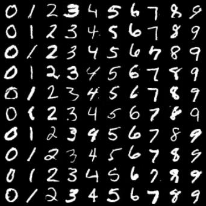
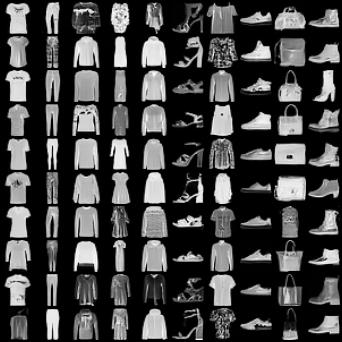
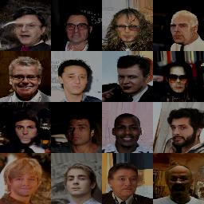
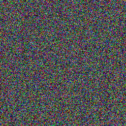
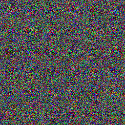
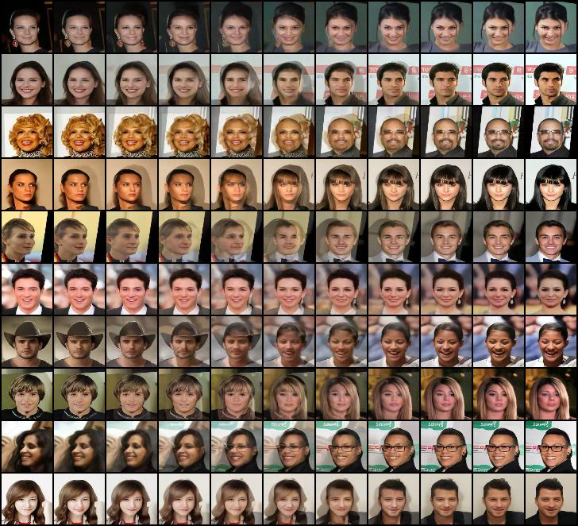

# **Diffusion-Models**

## **1. Introduction**
Diffusion model is a type of generative model. Its approach is different from GAN, VAE and Flow-based models. In my repository, I re-setup diffusion model from scratch to do some experiments:
* Diffusion Model
* Inference with DDPM and  DDIM
* Using label as condition for diffusion model
* Latent diffusion: Image space to latent space

## **2. Set Up**
  ### **Clone the repository**
    https://github.com/huynhspm/Diffusion-Model
    
  ### **Install environment packages**
    cd Diffusion-Model
    conda create -n diffusion python=3.10
    conda activate diffusion 
    pip install -r requirements.txt

  ### **Training Diffusion**
  set-up CUDA_VISIBLE_DEVICES and WANDB_API_KEY before training
  
    export CUDA_VISIBLE_DEVICES=0,1
    export WANDB_API_KEY=???
    python src/train.py experiment=diffusion_mnist trainer.devices=2
  ### **Inference**
    Inference: 

  ### **Training AutoEncoder**
  set-up CUDA_VISIBLE_DEVICES and WANDB_API_KEY before training

    export CUDA_VISIBLE_DEVICES=0,1
    export WANDB_API_KEY=ac6fadd5c937cb76a00106a28a5986a73e0cad60
    python src/train.py experiment=autoencoder_mnist trainer.devices=2

## **3. Diffusion Model**
### **3.1. Dataset**
  - MNIST DATASET
  - FASHION-MNIST DATASET
  - CIFAR10 DATASET
  - [GENDER DATASET](https://www.kaggle.com/datasets/yasserhessein/gender-dataset)
  - [CELEBA DATASET](https://www.kaggle.com/datasets/badasstechie/celebahq-resized-256x256)
### **3.2. Attention**
  - Self Attention
  - Cross Attention
  - Spatial Transformer
### **3.3. Backbone**
  - ResNet Block
  - VGG Block
  - DenseNet Block
  - Inception Block
### **3.4. Sample**
  - DDPM: Denoising Diffusion Probabilistic Models
  - DDIM: Denoising Diffusion Implicit Models
### **3.5. Model**
  - Unconditional diffusion model
  - Conditional diffusion model (label)
## **4. RESULTS**
### **4.1. Unconditional Diffusion**

    
### **4.2. Conditional Diffusion**
#### **MINST and FASHION-MNIST**

#### **GENDER**: 
- MALE and FEMALE

### **4.3 DDPM and DDIM**
#### **DDPM**

#### **DDIM**

### **4.4 INTERPOLATION**
