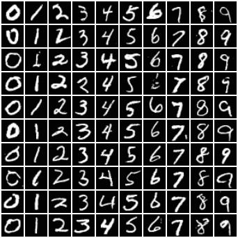
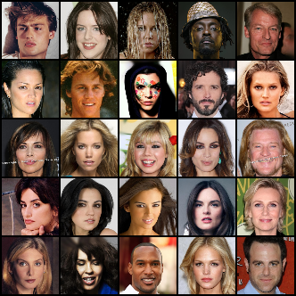

# **Diffusion-Models**

## **1. Introduction**
Diffusion model is a type of generative model. Its approach is different from GAN, VAE and Flow-based models. In my repository, I re-setup diffusion model from scratch to do some experiments:
* Diffusion Model: Training with simple loss
* Inference with DDPM and  DDIM
* Using (label, image, text) as condition for diffusion model
* Latent diffusion: Image space to latent space with VAE
* Stable diffusion: Latent + Condition Diffusion
* Classifier-free guidance
* Sketch2Image: using condition as sketch image
* Medical Image Segmentation: using condition as medical image

## **2. Set Up**

  ### **Clone the repository**
    https://github.com/huynhspm/Generative-Model
    
  ### **Install environment packages**
    cd Generative-Model
    conda create -n diffusion python=3.10
    conda activate diffusion 
    pip install -r requirements.txt

  ### **Training**
  set-up CUDA_VISIBLE_DEVICES and WANDB_API_KEY before training
  
    export CUDA_VISIBLE_DEVICES=0
    export WANDB_API_KEY=???

  choose from available experiments in folder "configs/experiment" or create your experiment to suit your task.
    
    # for generation task
    python src/train.py experiment=generation/diffusion/train/mnist trainer.devices=1

    # for reconstruction task
    python src/train.py experiment=reconstruction/vq_vae/celeba trainer.devices=1
  
    # for segmentation task
    python src/train.py experiment=segmentation/condition_diffusion/train/lidc trainer.devices=1

  ### **Evaluation**
  set-up CUDA_VISIBLE_DEVICES and WANDB_API_KEY before evaluating
  
    export CUDA_VISIBLE_DEVICES=0
    export WANDB_API_KEY=???
  
  choose from available experiments in folder "configs/experiment" or create your experiment to suit your task.
    
    # for generation task
    python src/eval.py experiment=generation/diffusion/eval/mnist trainer.devices=1

    # for reconstruction task
    ...

    # for segmentation task
    python src/eval.py experiment=segmentation/condition_diffusion/eval/lidc trainer.devices=1
  
  ### **Inference**
    ...
    
## **3. Diffusion Model**

### **3.1. Dataset**

  - **Generation task**:
    - MNIST, FASHION-MNIST: 28x28 pixels
    - CIFAR10: 32x32 pixels
    - [GENDER](https://www.kaggle.com/datasets/yasserhessein/gender-dataset): 64x64 pixels
    - [CELEBA](https://www.kaggle.com/datasets/badasstechie/celebahq-resized-256x256): 256x256 pixels 
    - [AFHQ](https://www.kaggle.com/datasets/andrewmvd/animal-faces), [FFHQ](https://www.kaggle.com/datasets/greatgamedota/ffhq-face-data-set): 512x512 pixels
  
  - **Segmentation task**:
    - [LIDC-IDRI](https://wiki.cancerimagingarchive.net/pages/viewpage.action?pageId=1966254)
    - [CVC-CLINIC](https://www.kaggle.com/datasets/balraj98/cvcclinicdb)
    - [ISIC](https://challenge.isic-archive.com/data/)
  
### **3.2. Attention**
  - Self Attention
  - Cross Attention
  - Spatial Transformer
  
### **3.3. Backbone**
  - ResNet Block
  - VGG Block
  - DenseNet Block
  - Inception Block

### **3.4 Embedder**
  - Time
  - Label: animal (dog, cat), number (0,1,...9), gender (male, female)
  - Image: Sketch2Image, Segmentation
  - Text: not implemented

### **3.5. Sampler**
  - DDPM: Denoising Diffusion Probabilistic Models
  - DDIM: Denoising Diffusion Implicit Models

### **3.6. Model**
  - Unet: Encoder, Decoder
  - Unconditional Diffusion Model
  - Conditional diffusion model (label, image, text - need to implement text embedder model)
  - Variational autoencoder: Vanilla (only work for reconstruction), VQ
  - Latent diffusion model
  - Stable diffusion model
  - Classifier-free; not work

## **4. RESULTS**

### **4.1. Unconditional Diffusion**

| Dataset  | Image-Size | FID (features=2048, ddim -> ddpm) | Config |
| :---: | :---: | :---: | :---:|
| Mnist |  32x32  | 2.65 -> 0.89 | [Train](configs/experiment/generation/diffusion/train/mnist.yaml), [Eval](configs/experiment/generation/diffusion/eval/mnist.yaml)|
| Fashion-Mnist | 32x32 | 3.31 -> 2.42 | [Train](configs/experiment/generation/diffusion/train/fashion.yaml), [Eval](configs/experiment/generation/diffusion/eval/fashion.yaml)|
| Cifar10 | 32x32 | 5.54 -> 3.58 | [Train](configs/experiment/generation/diffusion/train/cifar10.yaml), [Eval](configs/experiment/generation/diffusion/eval/cifar10.yaml) |

      

### **4.2. Conditional Diffusion**

| Dataset  | Image-Size | FID (features=2048, ddim -> ddpm) | Config |
| :---: | :---: | :---: | :---:|
| Mnist |  32x32  | 3.91 -> 1.16 | [Train](configs/experiment/generation/condition_diffusion/train/mnist.yaml), [Eval](configs/experiment/generation/condition_diffusion/eval/mnist.yaml)|
| Fashion-Mnist | 32x32 | 3.10 -> 2.15 | [Train](configs/experiment/generation/condition_diffusion/train/fashion.yaml), [Eval](configs/experiment/generation/condition_diffusion/eval/fashion.yaml)|
| Cifar10 | 32x32 | 5.66 -> 3.37 | [Train](configs/experiment/generation/condition_diffusion/train/cifar10.yaml), [Eval](configs/experiment/generation/condition_diffusion/eval/cifar10.yaml) |
| Gender | 64x64 | 3. | [Train](configs/experiment/generation/condition_diffusion/train), [Eval](configs/experiment/generation/condition_diffusion/eval/) |
| CelebA | 64x64 | 3. | [Train](configs/experiment/generation/condition_diffusion/train/), [Eval](configs/experiment/generation/condition_diffusion/eval/) |
  
 

 

- Sketch2Image (Sketch, Fake, Real)
  
  

### **4.3 DDPM and DDIM**

#### **DDPM (64x64)**

#### **DDIM (64x64)**

### **4.4 DIFFUSION INTERPOLATION (64x64)**

### **4.5 VAE RECONSTRUCTION**
#### **CIFAR10**

#### **AFHQ**

#### **GENDER**

#### **CELEBA**

### **4.5 VAE INTERPOLATION**
#### **CIFAR10 (32x32)**

#### **AFHQ (64x64)**

#### **CELEBA (128x128)**

### **4.6 Latent Diffusion**
#### **GENDER (128x128)**

#### **AFHQ (256x256)**

