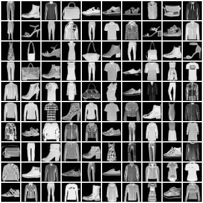

# **Diffusion-Models**

## **1. Introduction**
Diffusion model is a type of generative model. Its approach is different from GAN, VAE and Flow-based models. In my repository, I re-setup diffusion model from scratch to do some experiments:
* Diffusion Model: Training with simple loss
* Inference with DDPM and  DDIM
* Using (label, image, text) as condition for diffusion model
* Latent diffusion: Image space to latent space with VAE
* Stable diffusion: Latent + Condition Diffusion
* Classifier-free guidance

## **2. Set Up**
  ### **Clone the repository**
    https://github.com/huynhspm/Generative-Model
    
  ### **Install environment packages**
    cd Generative-Model
    conda create -n diffusion python=3.10
    conda activate diffusion 
    pip install -r requirements.txt

  ### **Training Diffusion**
  set-up CUDA_VISIBLE_DEVICES and WANDB_API_KEY before training
  
    export CUDA_VISIBLE_DEVICES=0,1
    export WANDB_API_KEY=???
    python src/train.py experiment=diffusion_mnist trainer.devices=2
  ### **Training VAE**
  set-up CUDA_VISIBLE_DEVICES and WANDB_API_KEY before training
  
    export CUDA_VISIBLE_DEVICES=0
    export WANDB_API_KEY=???
    python src/train.py experiment=vq_vae_celeba trainer.devices=1
  ### **Inference**
    Inference: 
    
## **3. Diffusion Model**
### **3.1. Dataset**
  - MNIST DATASET
  - FASHION-MNIST DATASET
  - CIFAR10 DATASET
  - [GENDER DATASET](https://www.kaggle.com/datasets/yasserhessein/gender-dataset)
  - [CELEBA DATASET](https://www.kaggle.com/datasets/badasstechie/celebahq-resized-256x256)
  - [AFHQ DATASET](https://www.kaggle.com/datasets/andrewmvd/animal-faces) 
  - [FFHQ DATASET](https://www.kaggle.com/datasets/greatgamedota/ffhq-face-data-set)
### **3.2. Attention**
  - Self Attention
  - Cross Attention
  - Spatial Transformer
### **3.3. Backbone**
  - ResNet Block
  - VGG Block
  - DenseNet Block
  - Inception Block
### **3.4 Embedder**
  - Label
  - Time
  - Image
  - Text: not implemented
### **3.5. Sampler**
  - DDPM: Denoising Diffusion Probabilistic Models
  - DDIM: Denoising Diffusion Implicit Models
### **3.6. Model**
  - Unet
  - Unconditional diffusion model
  - Conditional diffusion model (label, image, text - need to implement text embedder model)
  - Variational autoencoder: Vanilla (only work for reconstruction), VQ
  - Latent diffusion model
  - Classifier-free; not work
## **4. RESULTS**
### **4.1. Unconditional Diffusion**
#### **MINST and FASHION-MNIST (32x32)**

#### **CIFAR10 (32x32)**
    
### **4.2. Conditional Diffusion**
#### **MINST and FASHION-MNIST (32x32)**

#### **CIFAR10 (32x32)**

#### **GENDER (64x64)**: 
- Male and Female

#### **CELEBA (64x64)**
- Sketch2Image (Sketch, Fake, Real)
  

### **4.3 DDPM and DDIM**
#### **DDPM (64x64)**

#### **DDIM (64x64)**

### **4.4 DIFFUSION INTERPOLATION (64x64)**

### **4.5 VAE RECONSTRUCTION**
#### **CIFAR10**

#### **AFHQ**

#### **GENDER**

#### **CELEBA**

### **4.5 VAE INTERPOLATION**
#### **CIFAR10 (32x32)**

#### **AFHQ (64x64)**

#### **CELEBA (128x128)**

### **4.6 Latent Diffusion**
#### **GENDER (128x128)**

#### **AFHQ (256x256)**

